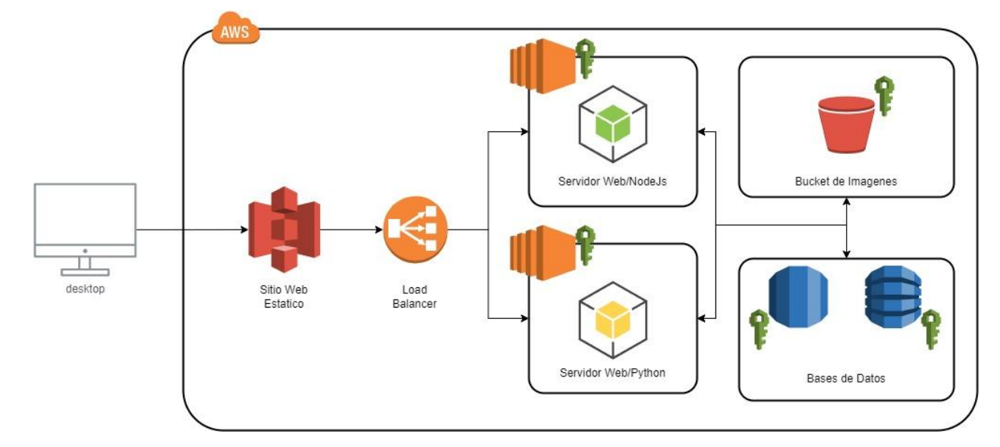
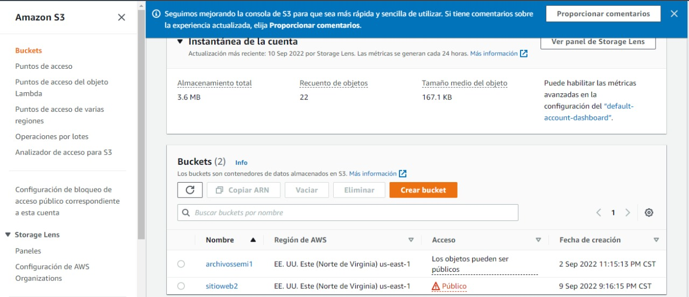
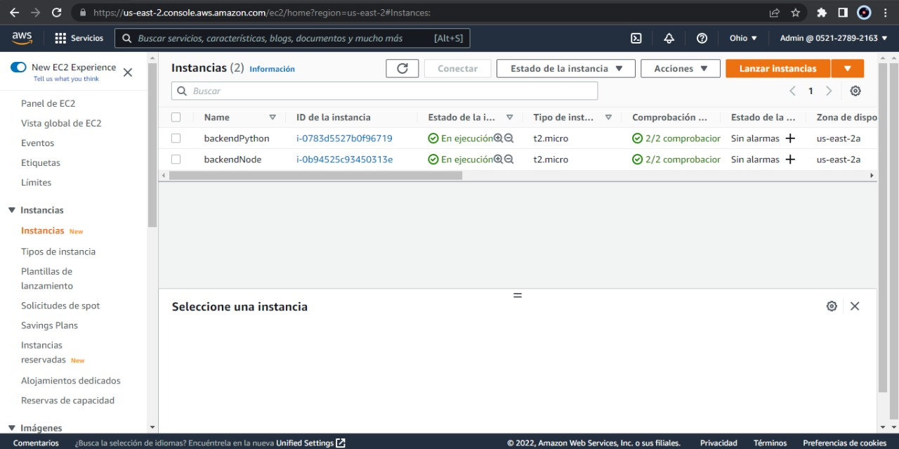
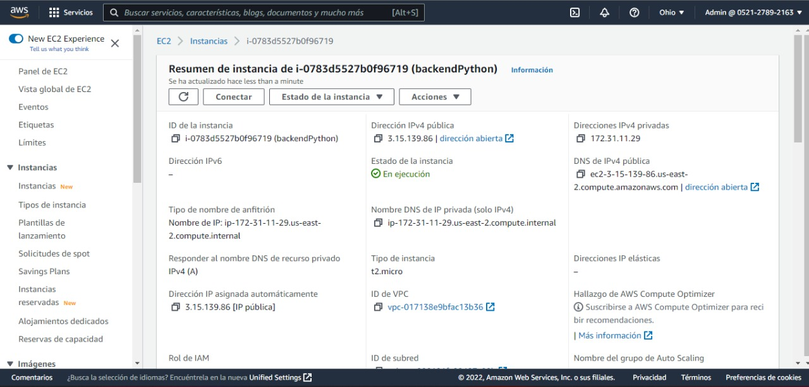
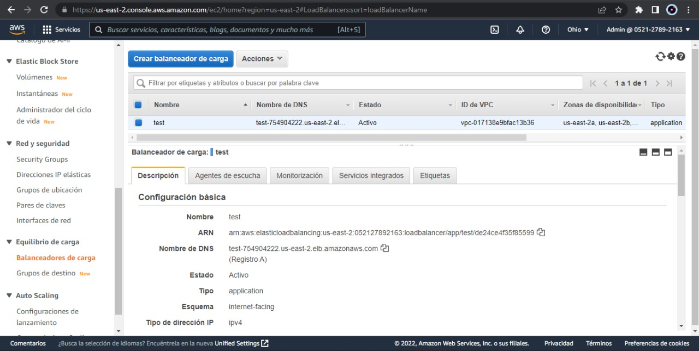
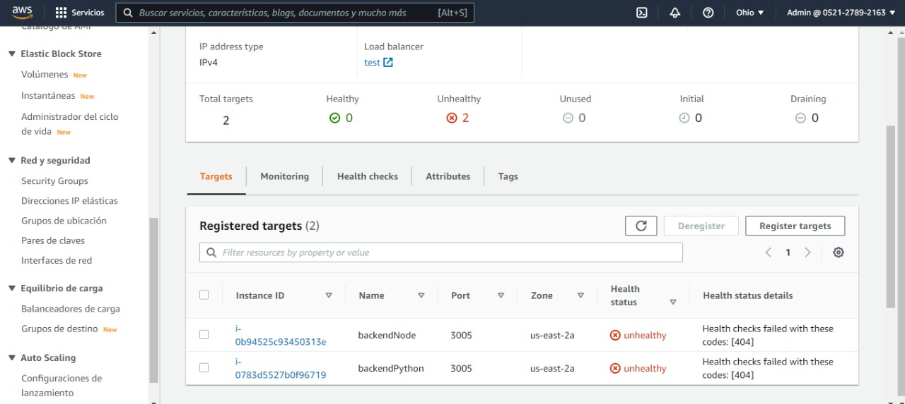
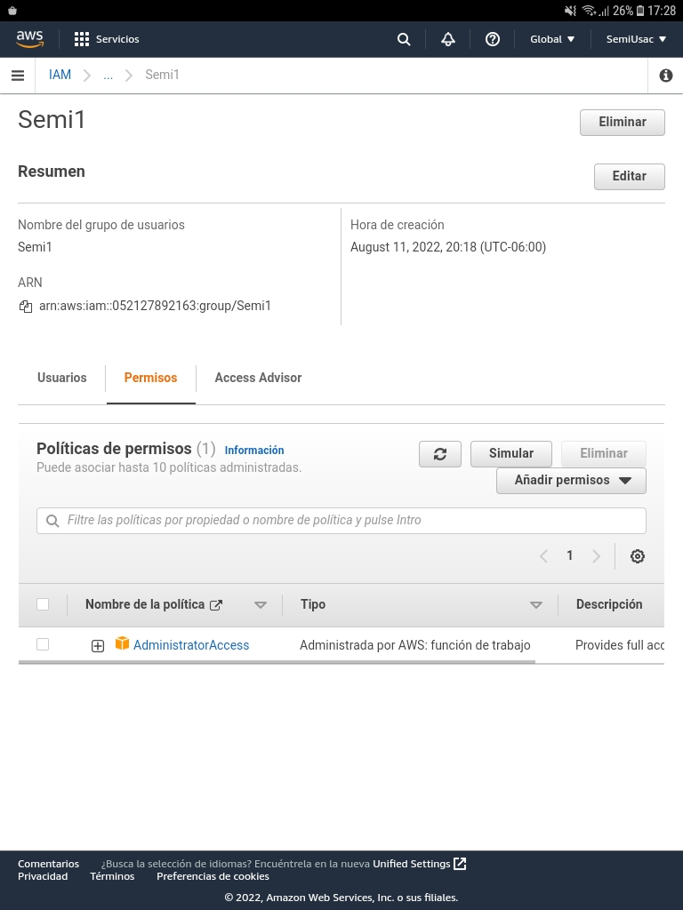
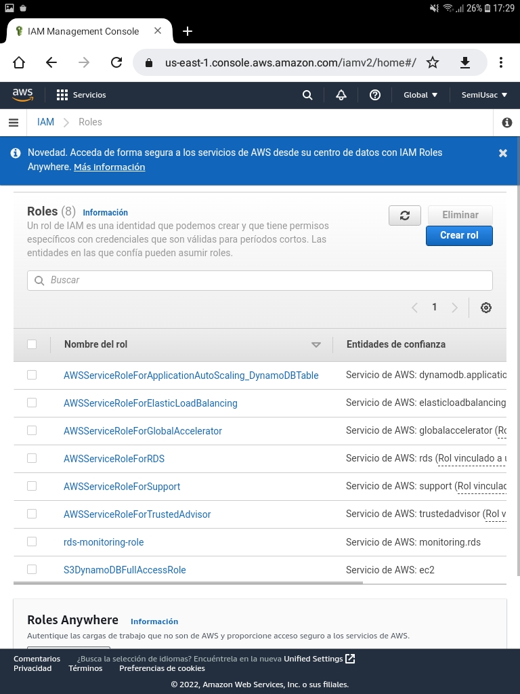

> # ***Manúal Técnico***
> 
> *Esta solucion fue elaborada con las herramientas que provee AWS, se utilizarón los servicios de EC2, S3, RDS, Load Balancer.*
> 
> ## ***Objetivos***
> *El siguiente manual, pretende ser una guía de como esta configurada e implementada la solucion, en el se describen las diferentes tecnologias que fueron implementadas, ademas de como se configuraron.*
> 
> *Tambien se encuentra explicado la logica y funcionamiento de la solucion completa.*
> 
> 
>   ## ***Arquitectura e Implementación***
> 
> 
> 
>   - *S3: El FrontEnd se elaboro en el lenguaje de React JS y esta alojado en un bucket de S3 funcionando como un sitio Web estático.
> Dicho FrontEnd se conecta al BackEnd por medio de un Load Balancer que distribuye las peticiones entre dos servidores.*
>
> ***
> 
>   #### [***Link de Acceso al sitio web***](http://sitioweb2.s3-website-us-east-1.amazonaws.com/)
>  
>   ## **Configuraciones S3**
> 
>   
> 
> - *EC2: Para BackEnd ser implementarón 2 servidores uno en NodeJS y otro en Python, ambos estan desplegados en una instancia distinta de EC2.*
> 
> ***
> 
>   ## ***Instancias EC2***
> 
>   
> 
> ***
> 
>   ## ***Servidor Node***
> 
>   
> 
> ***
> 
>   ## ***Servidor Python***
>   
>  
> - ***Load Balancer:** Se configuro un Load Balancer el cual distribuye las cargas de peticiones de los servidores desplegados en EC2*
> 
>   - [***Link de Acceso al sitio web***](http://test-754904222.us-east-2.elb.amazonaws.com/)
>   
>   ### ***Configuraciones***
> 
>   
> 
>   
> 
> - ***RDS:** Se configuro la intancia  de RDS con MySQL para el almacenamiento de datos.*
> 
>   - ***Datos del servidor:***
>     - *host: database-1.cy4vohpq0xqv.us-east-1.rds.amazonaws.com*
>     - *port: 3306*
> 
> ***
> 
> 
>   ## ***Usuarios IAM***
> Se utilizo el usuario "Semi1" el pertenece al grupo de usuario Semi1 y se le concedio permisos de administrador para tener total acceso hacia AWS
> 
>   ### ***Configuraciones***
> 
>   
> 
>   
> 
> ***
> 
> ## ***Conclusiones***
> 
>   - *Aws provee multiples servicios muy potentes, con los cuales se puede hacer diversidad de aplicaciones e implementaciones, el portal administrativo es un poco complejo, pero entendible, no se necesita de un conocimiento muy profundo para poder administrarlo.*
> 
>   - *Ademas provee un buen control de costos para ir evaluando los gastos en tiempo real, y poder elegir cuando parar de usar los servicios.*
> 
> 
> ### [**Indice**](../README.md)
> 
> ***