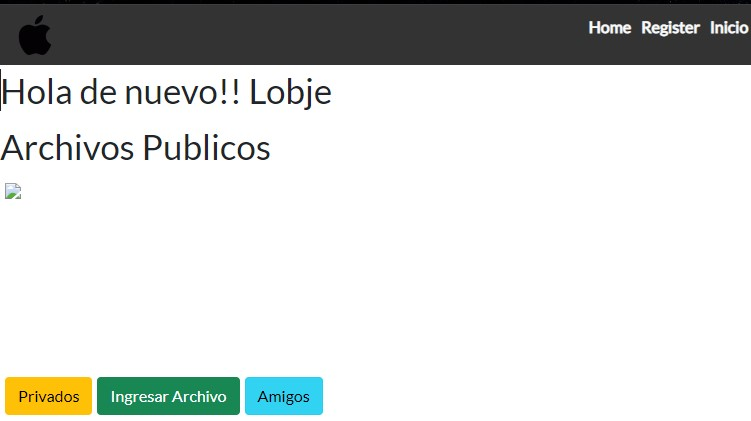

> # ***Manual de Usuario***
> ***
> 
> ## **Login**
> 
> ### *Antes debe crear una cuenta*
> 
>   - *Se debe ingresar el correo electronico registrado*
>   - *Se debe ingresar la contraseña registrada*
> 
> 
> 
> ***
> 
> ## **Register**
> 
> ### *Datos necesarios para un registro excepto subir un archivo*
>
>   - *Se necesita un nombre con el cual se presenta dentro del sitio web*
>   - *Es opcional subir un archivo al crear la cuenta*
>   - *Es necesario un correo electronico por motivos de seguridad y futuras notificaciones*
>   - *Es necesario una contraseña por motivos de seguridad y para ingresar a su perfil*
>   - *Es necesario confirmar la contraseña*
> 
> 
> 
> ***
> 
> ## **Dashboard Pantalla Principa**
> 
>   - *Se mostraran por defecto todos los archivos publicos subido a la plataforma*
>   - *Tiene la opción para ver los archivos privados*
>   - *Tiene opción de agregar nuevos archivos*
>   - Tiene la opcion de ver a los amigos
>  
> 
> 
> ***
> 
> ## **Subir Archivo**
> 
> ### *Para agregar un nuevo archivo a la plataforma se deben seguir los siguientes pasos*
>   - *Se debe dar clic en en el boton de ingresar archivo*
>   - *Se desplegara una nueva ventana*
> 
> 
> 
>   - *Se debe ingresar un nombre con el cual se registrara en la plataforma*
>   - *Presionar el boton **Seleccionar archivo** para buscar el archivo deseado*
>   - *Se debe seleccionar la visibilidad del archivo, ya sea pubico o privado*
>   - *Presionar **Submit** para cargar el archivo*
> 
> 
>   
>   - *Una vez cargado se mostrara de la sguiente forma, ya sea publico o privado*
> 
> 
> 
> ***
> 
> ## **Eliminar Archivo**
> 
> ### *Para eliminar un archivo privado o publico se deben seguir los siguientes pasos*
>
>   - *Buscar el archivo deseado*
>   - *Clic el boton de **eliminar** del archivo especifico*
> 
> 
> 
> ***
> 
> ## **Editar Archivo**
> 
> ### *Para editar los datos de un archivo privado o publico se deben seguir los siguientes pasos*
> 
>   - *Buscar el archivo deseado*
>   - *Clic en el boton **editar** del archivo especifico*
> 
> 
>   
>   - *Se presentara la informacion actual*
> 
> 
> 
>   - *Editar los datos necesarios*
>       - *Nombre del archivo*
>       - *Tipo de visibilidad*
>   - *Para realizar los cambios debe ingresar su contraseña*
>   - *Clic en el boton **submit** para actualizar los datos*
> 
> 
> 
>   - *Al finalizar se lo mostrara en el grupo de archivos seleccionado ya sea publico o privado*
> 
> 
> 
> ***
> 
> ## **Agregar Amigos**
> 
> ### *Para agregae amigos se deben hacer lo siguiente*
> 
>   - *Clic en el boton **Amigos***
> 
> 
> 
>   - *Se mostraran todos las persona registadas en la plataforma*
>   - *Para agregar a un usuario como amigo*
>       - *Dar clic en el icono azul*
>   - *Una vez se conviertan en amigo apareceran los archivos publicos del usuario y viceversa*
> 
> 
> 
> ***
> 
> ## **Visualización de Archivos**
> 
> ### *Por defecto apareceran en su perfil todos los archivos publicos tanto suyos como los de sus amigos*
> 
> 
> 
> ### *Para observar los archivos privado clic en el boton **Privados***
> 
> 
> 
> ***
> 
> ### [**Indice**](/Semi1-Grupo4-Proyecto1/README.md)
> ***